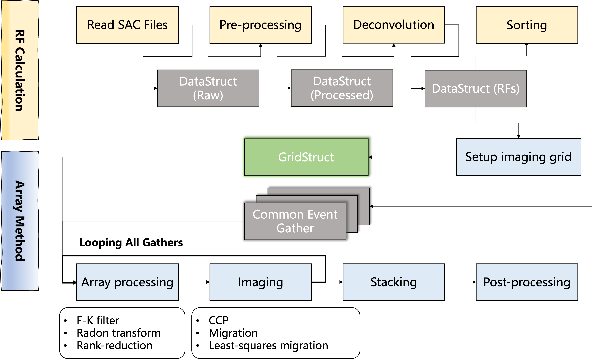

# Dense Array Toolkit

## Overview
Dense array toolkit (DAT) is an open-source, MATLAB-based software package for dense seismic array data processing and imaging. Motivated by the increasing deployment of large-N seismic arrays and the growing demand for advanced data analysis tools, DAT provides a comprehensive framework that integrates receiver function calculation, data processing  techniques (such as radon transform, and rank-reduction methods), and advanced imaging algorithms including common conversion point stacking, migration, and least-squares migration. 


## Objects
DAT is designed for efficient processing of large volumes of short-period nodal seismic data, with three key modules:
- rapid receiver function calculation
- advanced array-based data processing
- improved subsurface structure imaging

## Features
The software comprises three key struct variables:
- **DataStruct**: 
Stores essential seismic data information, including fields such as Waveforms, TimeAxis, StationInfo, EventInfo, Header, RF, TravelInfo, and ProcHistory.

- **GridStruct**: 
Defines the spatial grid configuration of the array. Station coordinates are projected onto a Cartesian coordinate system aligned with the principal and secondary axes.
- **ParamStruct**: 
Contains parameters for data preprocessing, such as filtering, normalization, and time window selection.



## Quickstart
The software is entirely written in MATLAB, and can be easily installed and used on Windows, Linux, and macOS. MATLAB R2021a or later is recommended.

The following is a quickstart guide to get you started.

1. **Download the source code**:  
   - Clone the DAT repository (DAT-public branch) from GitHub:
     ```bash
     git clone -b DAT-public git@github.com:PengfeiZuo001/DenseArrayToolkit.git DenseArrayToolkit-public
     ```
     Or 
     download the source code from [here](https://github.com/PengfeiZuo001/DenseArrayToolkit/tree/DAT-public).
   
   - Run `setupPaths.m` in `DenseArrayToolkit-public/` directory to setup the path:

2. **Run the demo**: 
   - Change directory to `DenseArrayToolkit-public/demo/` directory.

   - Run `demo_Stacking.m` to perform the stacking demo.

   - Run `demo_rankReduction.m` to perform the rank reduction demo.

   - Run `demo_Migration_2D.m` to perform the 2D LSM demo.

   - Run `demo_Migration_3D.m` to perform the 3D LSM demo.


4. **Explore Documentation (Coming soon)**:  
   - To be updated.


## How to cite 

If you use DAT in your research, please cite it as follows:

> - Chen, Y., Gu, Y. J., Zuo, P., Zhang, Q., Wang, H., & Chen, Y. (2025). Least-squares migration imaging of receiver functions. IEEE Transactions on Geoscience and Remote Sensing. [PDF](https://ieeexplore.ieee.org/stamp/stamp.jsp?tp=&arnumber=10928715)

## Contributing
We welcome contributions!

Feel free to contact with us if you have good ideas and suggestions.

## Related tools

In addition to the Dense Array Toolkit (DAT), there are several other tools and software packages that may complement your seismic array data analysis workflows. 
Below are some commonly used tools:

- [**SeisPy**](https://seispy.xumijian.me/latest/): A graphical interface Python module for receiver function (RF) calculation and post-processing in seismological research.  

- [**RfPy**](https://github.com/paudetseis/RfPy): A Python-based tool for receiver function analysis, designed for efficient and reproducible workflows.  

- [**rf**](https://github.com/trichter/rf): A Python package for receiver function calculation and analysis, developed by Eulenfeld (2020). It is designed for efficient workflows and reproducible research.  


```{toctree}
:maxdepth: 2
:hidden:
:caption: Introduction:

Introduction
Getting_started

```

```{toctree}
:maxdepth: 2
:hidden:
:caption: Modules:

RF
ArrayProcessing
Imaging

```

```{toctree}
:maxdepth: 1
:hidden:
:caption: Development:

Next
Changelog

```
