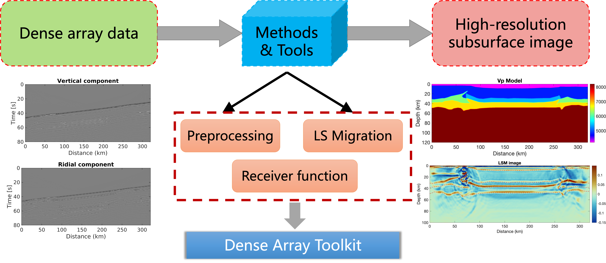

# Dense Array Toolkit

## Overview
Dense array toolkit (DAT) is an open-source, MATLAB-based software package for dense seismic array data processing and imaging. 
Motivated by the increasing deployment of large-N seismic arrays and the growing demand for advanced data analysis tools, 
DAT provides a comprehensive framework that bridges methodologies between exploration community and passive-source seismology.




## Objects
DAT is built around a set of core objects that represent different components of seismic data and processing workflows.
These objects are designed to simplify data handling and ensure modularity. 
Below are the key objects in DAT:
- **Object1**: 
Represents raw or processed seismic data, including waveforms, metadata, and station information.

- **Object2**: 
Encodes the spatial configuration of the seismic array, including station coordinates and array layout.

- **Object3**: 
Stores parameters for data preprocessing, such as filtering, normalization, and time window selection.


## Features
- **Data Processing**: 
Tools for preprocessing seismic data

- **Array Imaging**: 
Functions for beamforming, slowness analysis, and migration.

- **Reflection Profile Analysis**: 
Modules for receiver function analysis and crustal structure imaging.

- **Modular Design**: 
Organized into distinct modules for flexibility and ease of use.

- **Open Source**: 
Fully customizable and extendable for specific research needs.


## Quickstart

Follow these steps to quickly get started with the Dense Array Toolkit (DAT):

1. **Installation**:  
   - Ensure MATLAB is installed on your system.  
   - Clone the DAT repository from GitHub:
     ```bash
     git clone https://github.com/your-repo/DenseArrayToolkit.git
     ```
   - Add the DAT folder to your MATLAB path:
     ```matlab
     addpath('/path/to/DenseArrayToolkit');
     ```

2. **Load Example Data**:  
   - DAT includes example datasets to help you get started. Load the example data using:
     ```matlab
     data = load('example_data.mat');
     ```

3. **Run a Basic Workflow**:  
   - Preprocess the data:
     ```matlab
     processed_data = preprocess(data, 'filter', [0.1, 1.0]);
     ```
   - Perform beamforming:
     ```matlab
     result = beamform(processed_data, 'slowness', [0.04, 0.08]);
     ```
   - Visualize the results:
     ```matlab
     plotBeamformingResult(result);
     ```

4. **Explore Documentation**:  
   - Refer to the Getting Started Guide for detailed instructions and additional examples.


## How to cite 

If you use DAT in your research, please cite it as follows:

> - Chen, Y., Gu, Y. J., Zuo, P., Zhang, Q., Wang, H., & Chen, Y. (2025). Least-squares migration imaging of receiver functions. IEEE Transactions on Geoscience and Remote Sensing.
> - Chen, Y., Gu, Y. J., Zuo, P., Zhang, Q., Wang, H., & Chen, Y. (2025). Least-squares migration imaging of receiver functions. IEEE Transactions on Geoscience and Remote Sensing.
> - Chen, Y., Gu, Y. J., Zuo, P., Zhang, Q., Wang, H., & Chen, Y. (2025). Least-squares migration imaging of receiver functions. IEEE Transactions on Geoscience and Remote Sensing.

## Contributing
We welcome contributions!

Feel free to contact with us if you have good ideas and suggestions.

## Related Tools

In addition to the Dense Array Toolkit (DAT), there are several other tools and software packages that may complement your seismic data analysis workflows. 
Below are some commonly used tools:

- [**SeisPy**](https://seispy.xumijian.me/latest/): A graphical interface Python module for receiver function (RF) calculation and post-processing in seismological research.  

- [**RfPy**](https://github.com/paudetseis/RfPy): A Python-based tool for receiver function analysis, designed for efficient and reproducible workflows.  

- [**rf**](https://github.com/trichter/rf): A Python package for receiver function calculation and analysis, developed by Eulenfeld (2020). It is designed for efficient workflows and reproducible research.  


```{toctree}
:maxdepth: 2
:hidden:
:caption: Introduction:

Introduction
Why_DAT
Getting_started

```

```{toctree}
:maxdepth: 2
:hidden:
:caption: Installation:

Installation
Structure

```

```{toctree}
:maxdepth: 2
:hidden:
:caption: Examples:

Example1
Example2
```

```{toctree}
:maxdepth: 2
:hidden:
:caption: Modules:

RF
ArrayProcessing
Imaging

```

```{toctree}
:maxdepth: 1
:hidden:
:caption: Development:

Next
Changelog

```
